# Emo Architecture

> Version 0.1.0 — Python, litellm-backed, multi-agent ReAct framework.

---

## Table of Contents

1. [High-Level Design (HLD)](#1-high-level-design-hld)
2. [Component Descriptions](#2-component-descriptions)
3. [Low-Level Design (LLD)](#3-low-level-design-lld)
   - [Config](#31-config)
   - [Providers](#32-providers)
   - [Memory](#33-memory)
   - [Tools](#34-tools)
   - [Skills](#35-skills)
   - [Agent Layer](#36-agent-layer)
   - [CLI](#37-cli)
4. [Data Flow Diagrams](#4-data-flow-diagrams)
   - [Startup & Initialisation](#41-startup--initialisation)
   - [Interactive REPL Turn](#42-interactive-repl-turn)
   - [Supervisor Routing](#43-supervisor-routing)
   - [ReAct Agent Loop](#44-react-agent-loop)
   - [Tool Dispatch](#45-tool-dispatch)
   - [Persistent Memory Read/Write](#46-persistent-memory-readwrite)
   - [Session Memory Sliding Window](#47-session-memory-sliding-window)
   - [Streaming Response](#48-streaming-response)
   - [Auto-Summarisation](#49-auto-summarisation)
5. [Extension Points](#5-extension-points)
6. [Dependency Graph](#6-dependency-graph)

---

## 1. High-Level Design (HLD)

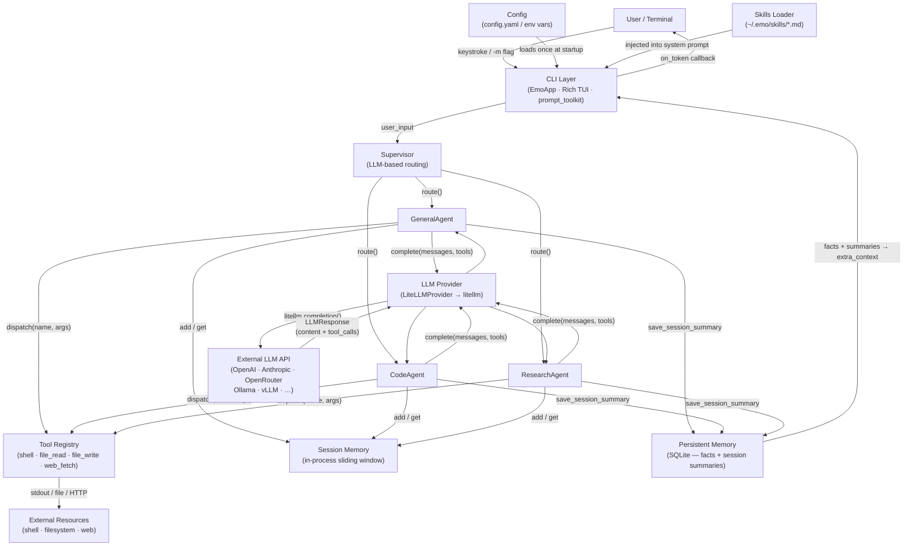
```mermaid
graph TD
    User["User / Terminal"]
    CLI["CLI Layer\n(EmoApp · Rich TUI · prompt_toolkit)"]
    CFG["Config\n(config.yaml / env vars)"]
    SUP["Supervisor\n(LLM-based routing)"]
    GA["GeneralAgent"]
    CA["CodeAgent"]
    RA["ResearchAgent"]
    PROV["LLM Provider\n(LiteLLMProvider → litellm)"]
    LLM["External LLM API\n(OpenAI · Anthropic · OpenRouter\nOllama · vLLM · …)"]
    TOOLS["Tool Registry\n(shell · file_read · file_write · web_fetch)"]
    SMEM["Session Memory\n(in-process sliding window)"]
    PMEM["Persistent Memory\n(SQLite — facts + session summaries)"]
    SKILLS["Skills Loader\n(~/.emo/skills/*.md)"]

    User -->|"keystroke / -m flag"| CLI
    CFG -->|"loads once at startup"| CLI
    SKILLS -->|"injected into system prompt"| CLI
    PMEM -->|"facts + summaries → extra_context"| CLI
    CLI -->|"user_input"| SUP
    SUP -->|"route()"| GA & CA & RA
    GA & CA & RA -->|"complete(messages, tools)"| PROV
    PROV -->|"litellm.completion()"| LLM
    LLM -->|"LLMResponse\n(content + tool_calls)"| PROV
    PROV --> GA & CA & RA
    GA & CA & RA -->|"dispatch(name, args)"| TOOLS
    TOOLS -->|"stdout / file / HTTP"| EXT["External Resources\n(shell · filesystem · web)"]
    GA & CA & RA -->|"add / get"| SMEM
    GA & CA & RA -->|"save_session_summary"| PMEM
    CLI -->|"on_token callback"| User
```

**Key design principles:**

- **Provider abstraction** — `BaseAgent` never imports `litellm`. All LLM calls go through the injected `BaseLLMProvider`.
- **Shared session memory** — all three sub-agents read/write the same `SessionMemory` instance, preserving full history when the supervisor switches agents mid-conversation.
- **Lazy agent instantiation** — the `Supervisor` holds agent *classes* until first use; no agent object is created until it is actually routed to.
- **ABC everywhere** — every layer (`BaseLLMProvider`, `BaseMemory`, `BasePersistentMemory`, `BaseTool`, `BaseAgent`) exposes an abstract interface, making every layer independently swappable.

---

## 2. Component Descriptions

| Component | Module | Responsibility |
|---|---|---|
| **CLI / EmoApp** | `emo/cli.py` | Rich TUI REPL, slash-command handler, startup wiring, streaming output, auto-summarisation trigger |
| **Config** | `emo/config.py` | YAML loading, deep-merge with defaults, property accessors, `api_base` → `litellm_model` normalization |
| **LiteLLMProvider** | `emo/providers/__init__.py` | Wraps `litellm.completion()` for both blocking and streaming; parses tool_calls from both response styles |
| **SessionMemory** | `emo/memory/__init__.py` | In-process message list; token-budget sliding window trims oldest non-system messages |
| **PersistentMemory** | `emo/memory/__init__.py` | SQLite; `facts` table (upsert key/value) + `sessions` table (timestamped summaries) |
| **ToolRegistry** | `emo/tools/__init__.py` | Singleton registry; `dispatch()` parses JSON args and calls the named tool; `schemas()` builds OpenAI function-call schema list |
| **Built-in Tools** | `emo/tools/__init__.py` | `shell` (subprocess), `file_read` (pathlib), `file_write` (pathlib), `web_fetch` (httpx) |
| **Skills Loader** | `emo/skills/__init__.py` | Reads `*.md` files from `skills_dir` at startup; concatenated into system prompt |
| **BaseAgent** | `emo/agent/base_agent.py` | ReAct loop: build messages → call provider → if tool_calls dispatch tools and loop, else return |
| **Supervisor** | `emo/agent/supervisor.py` | Classifies intent via `complete_simple()` (temp=0, max_tokens=10) → routes to registered agent |
| **Sub-agents** | `emo/agent/agents/__init__.py` | `GeneralAgent`, `CodeAgent`, `ResearchAgent` — differ only in `system_prompt` and allowed `tool_names` |

---

## 3. Low-Level Design (LLD)

### 3.1 Config

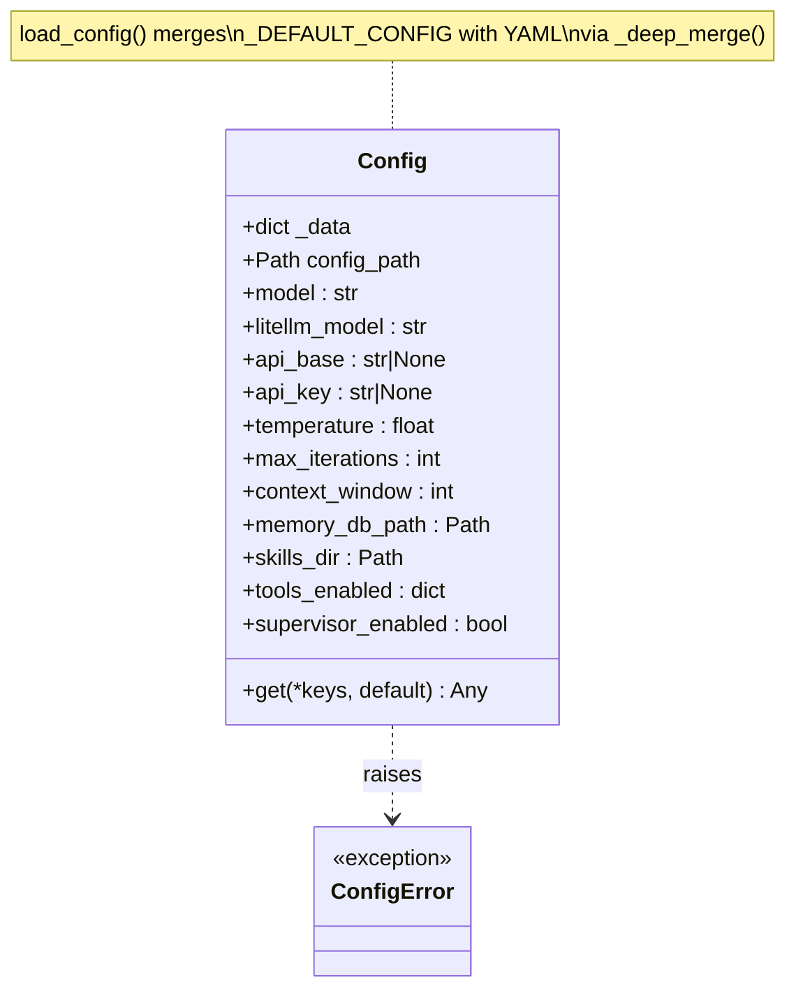
```mermaid
classDiagram
    class Config {
        +dict _data
        +Path config_path
        +get(*keys, default) Any
        +model : str
        +litellm_model : str
        +api_base : str|None
        +api_key : str|None
        +temperature : float
        +max_iterations : int
        +context_window : int
        +memory_db_path : Path
        +skills_dir : Path
        +tools_enabled : dict
        +supervisor_enabled : bool
    }
    class ConfigError {
        <<exception>>
    }
    Config ..> ConfigError : raises
    note for Config "load_config() merges\n_DEFAULT_CONFIG with YAML\nvia _deep_merge()"
```

Config search order:
1. `--config <path>` CLI flag
2. `EMO_CONFIG` environment variable
3. `./config.yaml` (cwd)
4. `~/.emo/config.yaml`

`litellm_model` normalisation rule: when `api_base` is set and the model string does not already start with `openai/`, it is prepended automatically (required for litellm's OpenAI-compatible routing path).

---

### 3.2 Providers

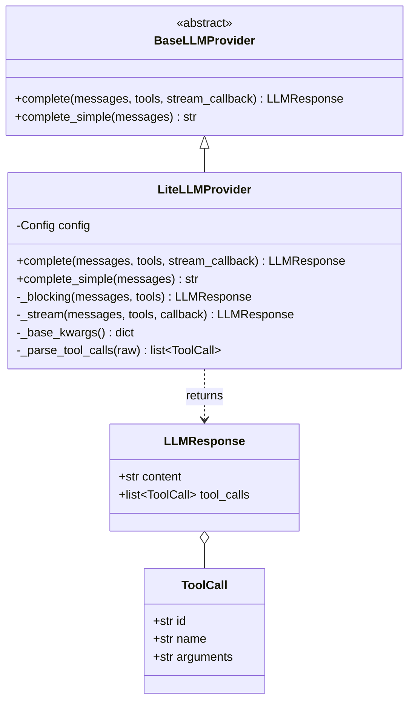
```mermaid
classDiagram
    class BaseLLMProvider {
        <<abstract>>
        +complete(messages, tools, stream_callback) LLMResponse
        +complete_simple(messages) str
    }
    class LiteLLMProvider {
        -Config config
        +complete(messages, tools, stream_callback) LLMResponse
        +complete_simple(messages) str
        -_blocking(messages, tools) LLMResponse
        -_stream(messages, tools, callback) LLMResponse
        -_base_kwargs() dict
        -_parse_tool_calls(raw) list~ToolCall~
    }
    class LLMResponse {
        +str content
        +list~ToolCall~ tool_calls
    }
    class ToolCall {
        +str id
        +str name
        +str arguments
    }
    BaseLLMProvider <|-- LiteLLMProvider
    LiteLLMProvider ..> LLMResponse : returns
    LLMResponse o-- ToolCall
```

`complete_simple()` uses `temperature=0.0, max_tokens=10` — it is only called by the supervisor for intent classification, where cost matters more than quality.

Streaming accumulates tool-call deltas in a dict keyed by `index`, then assembles them into `ToolCall` objects after the stream ends — identical shape to the blocking path.

---

### 3.3 Memory

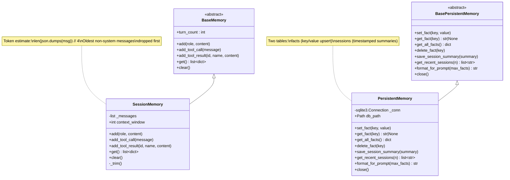
```mermaid
classDiagram
    class BaseMemory {
        <<abstract>>
        +add(role, content)
        +add_tool_call(message)
        +add_tool_result(id, name, content)
        +get() list~dict~
        +clear()
        +turn_count : int
    }
    class SessionMemory {
        -list _messages
        +int context_window
        +add(role, content)
        +add_tool_call(message)
        +add_tool_result(id, name, content)
        +get() list~dict~
        +clear()
        -_trim()
    }
    class BasePersistentMemory {
        <<abstract>>
        +set_fact(key, value)
        +get_fact(key) str|None
        +get_all_facts() dict
        +delete_fact(key)
        +save_session_summary(summary)
        +get_recent_sessions(n) list~str~
        +format_for_prompt(max_facts) str
        +close()
    }
    class PersistentMemory {
        -sqlite3.Connection _conn
        +Path db_path
        +set_fact(key, value)
        +get_fact(key) str|None
        +get_all_facts() dict
        +delete_fact(key)
        +save_session_summary(summary)
        +get_recent_sessions(n) list~str~
        +format_for_prompt(max_facts) str
        +close()
    }
    BaseMemory <|-- SessionMemory
    BasePersistentMemory <|-- PersistentMemory

    note for SessionMemory "Token estimate:\nlen(json.dumps(msg)) // 4\nOldest non-system messages\ndropped first"
    note for PersistentMemory "Two tables:\nfacts (key/value upsert)\nsessions (timestamped summaries)"
```

**SQLite schema:**

```sql
CREATE TABLE facts (
    id         INTEGER PRIMARY KEY AUTOINCREMENT,
    key        TEXT NOT NULL,
    value      TEXT NOT NULL,
    created_at REAL NOT NULL,
    updated_at REAL NOT NULL
);
CREATE UNIQUE INDEX facts_key ON facts(key);

CREATE TABLE sessions (
    id         INTEGER PRIMARY KEY AUTOINCREMENT,
    summary    TEXT NOT NULL,
    created_at REAL NOT NULL
);
```

---

### 3.4 Tools

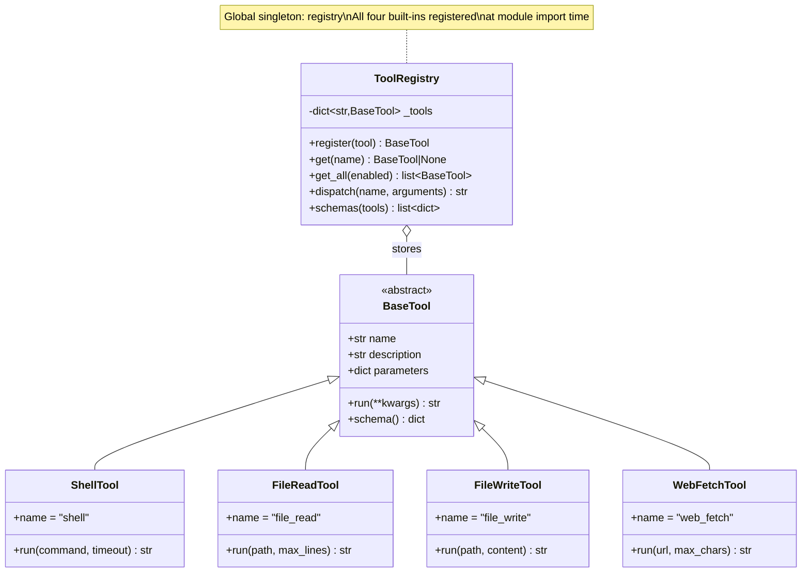
```mermaid
classDiagram
    class BaseTool {
        <<abstract>>
        +str name
        +str description
        +dict parameters
        +run(**kwargs) str
        +schema() dict
    }
    class ToolRegistry {
        -dict~str,BaseTool~ _tools
        +register(tool) BaseTool
        +get(name) BaseTool|None
        +get_all(enabled) list~BaseTool~
        +dispatch(name, arguments) str
        +schemas(tools) list~dict~
    }
    class ShellTool {
        +name = "shell"
        +run(command, timeout) str
    }
    class FileReadTool {
        +name = "file_read"
        +run(path, max_lines) str
    }
    class FileWriteTool {
        +name = "file_write"
        +run(path, content) str
    }
    class WebFetchTool {
        +name = "web_fetch"
        +run(url, max_chars) str
    }
    BaseTool <|-- ShellTool
    BaseTool <|-- FileReadTool
    BaseTool <|-- FileWriteTool
    BaseTool <|-- WebFetchTool
    ToolRegistry o-- BaseTool : stores
    note for ToolRegistry "Global singleton: registry\nAll four built-ins registered\nat module import time"
```

The `@tool` decorator wraps any plain function as an anonymous `BaseTool` subclass and registers it immediately in the global `registry`.

Sub-agent tool access:

| Agent | Allowed tools |
|---|---|
| `general` | shell, file_read, file_write, web_fetch |
| `code` | shell, file_read, file_write |
| `research` | web_fetch, file_read, file_write |

---

### 3.5 Skills

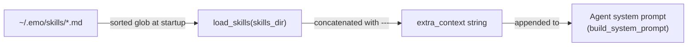
```mermaid
flowchart LR
    SD["~/.emo/skills/*.md"]
    LS["load_skills(skills_dir)"]
    EC["extra_context string"]
    SP["Agent system prompt\n(build_system_prompt)"]

    SD -->|"sorted glob at startup"| LS
    LS -->|"concatenated with ---"| EC
    EC -->|"appended to"| SP
```

Skills are plain Markdown files. They are loaded once at startup. Adding new files takes effect only after restart (or after `/remember`/`/forget` which trigger `_refresh_context()`).

---

### 3.6 Agent Layer

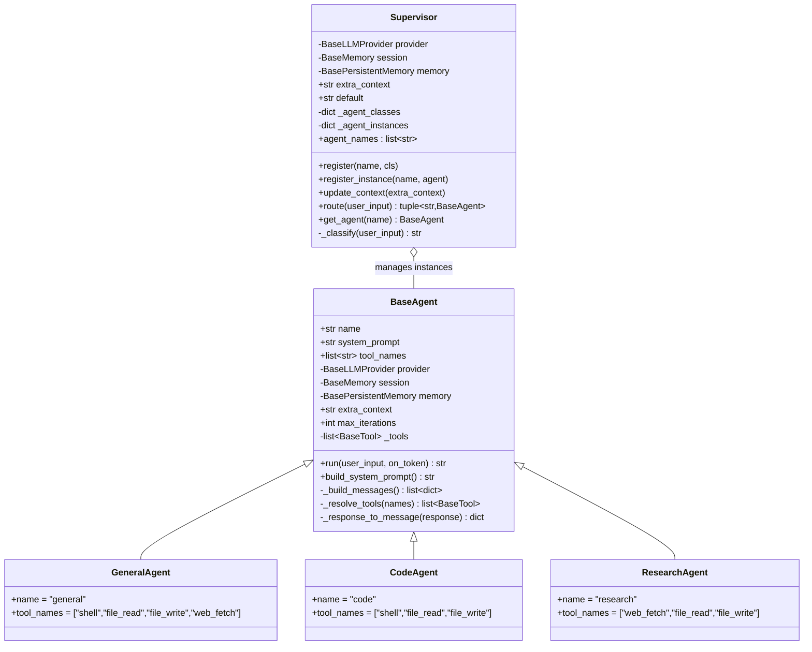
```mermaid
classDiagram
    class BaseAgent {
        +str name
        +str system_prompt
        +list~str~ tool_names
        -BaseLLMProvider provider
        -BaseMemory session
        -BasePersistentMemory memory
        +str extra_context
        +int max_iterations
        -list~BaseTool~ _tools
        +run(user_input, on_token) str
        +build_system_prompt() str
        -_build_messages() list~dict~
        -_resolve_tools(names) list~BaseTool~
        -_response_to_message(response) dict
    }
    class GeneralAgent {
        +name = "general"
        +tool_names = ["shell","file_read","file_write","web_fetch"]
    }
    class CodeAgent {
        +name = "code"
        +tool_names = ["shell","file_read","file_write"]
    }
    class ResearchAgent {
        +name = "research"
        +tool_names = ["web_fetch","file_read","file_write"]
    }
    class Supervisor {
        -BaseLLMProvider provider
        -BaseMemory session
        -BasePersistentMemory memory
        +str extra_context
        +str default
        -dict _agent_classes
        -dict _agent_instances
        +register(name, cls)
        +register_instance(name, agent)
        +update_context(extra_context)
        +route(user_input) tuple~str,BaseAgent~
        +get_agent(name) BaseAgent
        -_classify(user_input) str
        +agent_names : list~str~
    }
    BaseAgent <|-- GeneralAgent
    BaseAgent <|-- CodeAgent
    BaseAgent <|-- ResearchAgent
    Supervisor o-- BaseAgent : manages instances
```

---

### 3.7 CLI

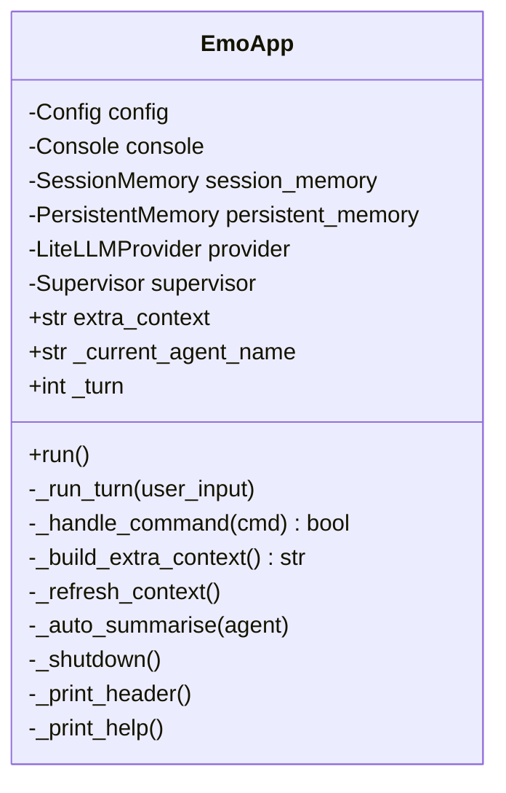
```mermaid
classDiagram
    class EmoApp {
        -Config config
        -Console console
        -SessionMemory session_memory
        -PersistentMemory persistent_memory
        -LiteLLMProvider provider
        -Supervisor supervisor
        +str extra_context
        +str _current_agent_name
        +int _turn
        +run()
        -_run_turn(user_input)
        -_handle_command(cmd) bool
        -_build_extra_context() str
        -_refresh_context()
        -_auto_summarise(agent)
        -_shutdown()
        -_print_header()
        -_print_help()
    }
```

Slash commands handled in `_handle_command()`:

| Command | Action |
|---|---|
| `/help` | Print command list |
| `/new` | Clear `SessionMemory`, reset turn counter |
| `/model <name>` | Mutate `config._data["model"]` in-place |
| `/agent <name>` | Pin `_current_agent_name`; bypass supervisor |
| `/auto` | Restore supervisor routing |
| `/memory` | Display all facts from `PersistentMemory` |
| `/remember <k> <v>` | `set_fact()` + `_refresh_context()` |
| `/forget <k>` | `delete_fact()` + `_refresh_context()` |
| `/skills` | List `*.md` files in `skills_dir` |
| `/status` | Print model, agent, turns, message count, fact count |
| `/exit` | `_shutdown()` + `sys.exit(0)` |

---

## 4. Data Flow Diagrams

### 4.1 Startup & Initialisation

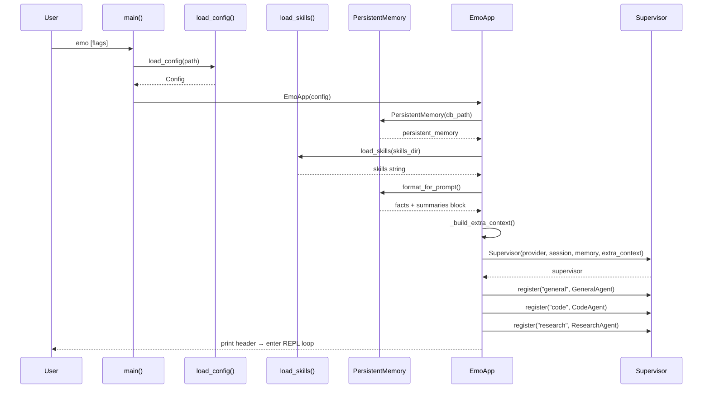
```mermaid
sequenceDiagram
    participant User
    participant main as main()
    participant LC as load_config()
    participant LS as load_skills()
    participant PM as PersistentMemory
    participant EA as EmoApp
    participant SUP as Supervisor

    User->>main: emo [flags]
    main->>LC: load_config(path)
    LC-->>main: Config
    main->>EA: EmoApp(config)
    EA->>PM: PersistentMemory(db_path)
    PM-->>EA: persistent_memory
    EA->>LS: load_skills(skills_dir)
    LS-->>EA: skills string
    EA->>PM: format_for_prompt()
    PM-->>EA: facts + summaries block
    EA->>EA: _build_extra_context()
    EA->>SUP: Supervisor(provider, session, memory, extra_context)
    SUP-->>EA: supervisor
    EA->>SUP: register("general", GeneralAgent)
    EA->>SUP: register("code", CodeAgent)
    EA->>SUP: register("research", ResearchAgent)
    EA-->>User: print header → enter REPL loop
```

---

### 4.2 Interactive REPL Turn

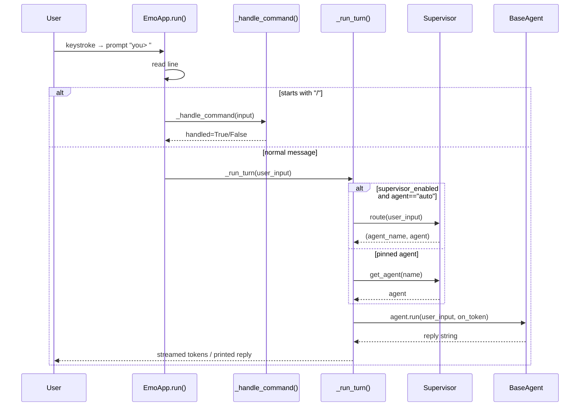
```mermaid
sequenceDiagram
    participant User
    participant REPL as EmoApp.run()
    participant CMD as _handle_command()
    participant TURN as _run_turn()
    participant SUP as Supervisor
    participant AGT as BaseAgent

    User->>REPL: keystroke → prompt "you> "
    REPL->>REPL: read line
    alt starts with "/"
        REPL->>CMD: _handle_command(input)
        CMD-->>REPL: handled=True/False
    else normal message
        REPL->>TURN: _run_turn(user_input)
        alt supervisor_enabled and agent=="auto"
            TURN->>SUP: route(user_input)
            SUP-->>TURN: (agent_name, agent)
        else pinned agent
            TURN->>SUP: get_agent(name)
            SUP-->>TURN: agent
        end
        TURN->>AGT: agent.run(user_input, on_token)
        AGT-->>TURN: reply string
        TURN-->>User: streamed tokens / printed reply
    end
```

---

### 4.3 Supervisor Routing

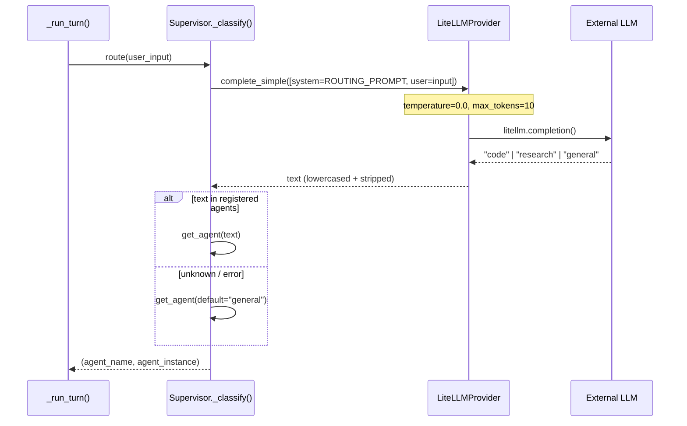
```mermaid
sequenceDiagram
    participant TURN as _run_turn()
    participant SUP as Supervisor._classify()
    participant PROV as LiteLLMProvider
    participant LLM as External LLM

    TURN->>SUP: route(user_input)
    SUP->>PROV: complete_simple([system=ROUTING_PROMPT, user=input])
    note over PROV: temperature=0.0, max_tokens=10
    PROV->>LLM: litellm.completion()
    LLM-->>PROV: "code" | "research" | "general"
    PROV-->>SUP: text (lowercased + stripped)
    alt text in registered agents
        SUP->>SUP: get_agent(text)
    else unknown / error
        SUP->>SUP: get_agent(default="general")
    end
    SUP-->>TURN: (agent_name, agent_instance)
```

Agent instantiation (first use only):

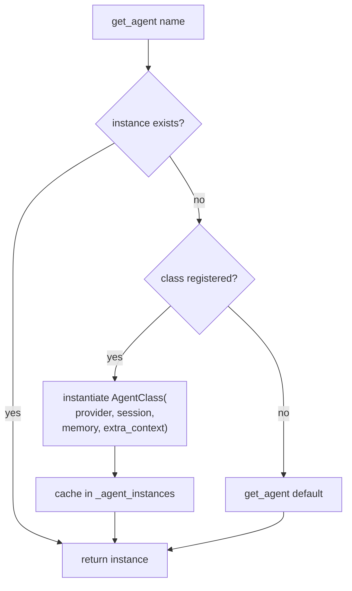
```mermaid
flowchart TD
    A[get_agent name] --> B{instance exists?}
    B -- yes --> Z[return instance]
    B -- no --> C{class registered?}
    C -- yes --> D["instantiate AgentClass(\nprovider, session,\nmemory, extra_context)"]
    D --> E[cache in _agent_instances]
    E --> Z
    C -- no --> F[get_agent default]
    F --> Z
```

---

### 4.4 ReAct Agent Loop

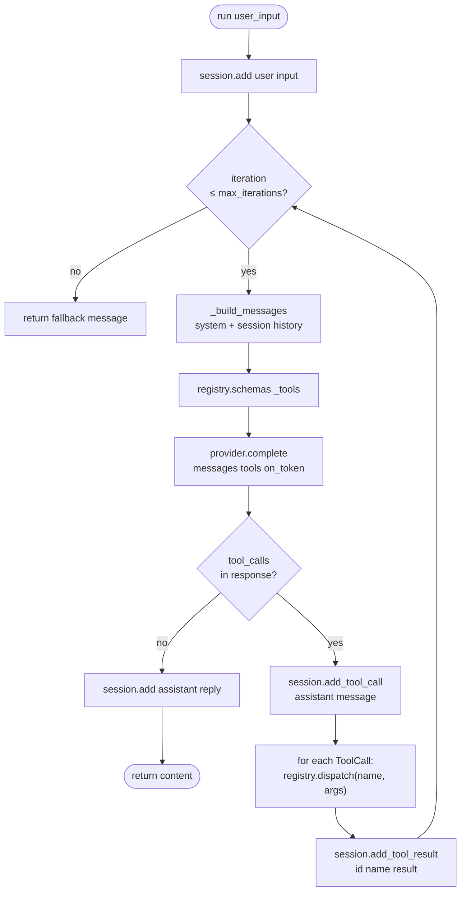
```mermaid
flowchart TD
    START([run user_input]) --> ADDUSER[session.add user input]
    ADDUSER --> LOOP{iteration\n≤ max_iterations?}
    LOOP -- no --> FALLBACK[return fallback message]
    LOOP -- yes --> BUILD[_build_messages\nsystem + session history]
    BUILD --> SCHEMAS[registry.schemas _tools]
    SCHEMAS --> CALL[provider.complete\nmessages tools on_token]
    CALL --> RESP{tool_calls\nin response?}
    RESP -- no --> ADDREPLY[session.add assistant reply]
    ADDREPLY --> RETURN([return content])
    RESP -- yes --> STORETC[session.add_tool_call\nassistant message]
    STORETC --> DISPATCH["for each ToolCall:\nregistry.dispatch(name, args)"]
    DISPATCH --> STORETR[session.add_tool_result\nid name result]
    STORETR --> LOOP
```

---

### 4.5 Tool Dispatch

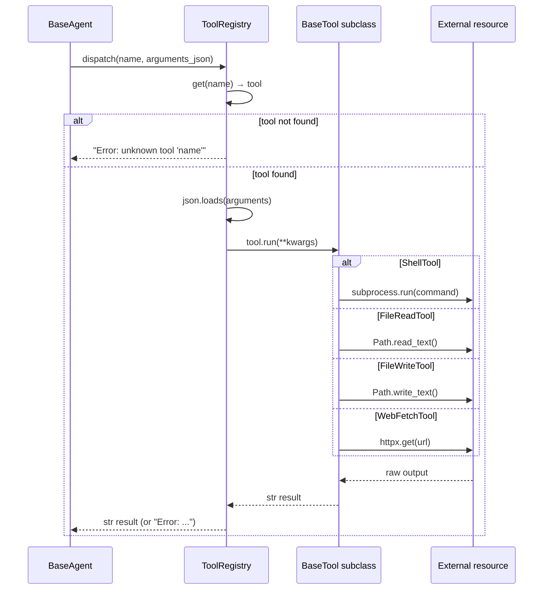
```mermaid
sequenceDiagram
    participant AGT as BaseAgent
    participant REG as ToolRegistry
    participant TOOL as BaseTool subclass
    participant EXT as External resource

    AGT->>REG: dispatch(name, arguments_json)
    REG->>REG: get(name) → tool
    alt tool not found
        REG-->>AGT: "Error: unknown tool 'name'"
    else tool found
        REG->>REG: json.loads(arguments)
        REG->>TOOL: tool.run(**kwargs)
        alt ShellTool
            TOOL->>EXT: subprocess.run(command)
        else FileReadTool
            TOOL->>EXT: Path.read_text()
        else FileWriteTool
            TOOL->>EXT: Path.write_text()
        else WebFetchTool
            TOOL->>EXT: httpx.get(url)
        end
        EXT-->>TOOL: raw output
        TOOL-->>REG: str result
        REG-->>AGT: str result (or "Error: ...")
    end
```

---

### 4.6 Persistent Memory Read/Write

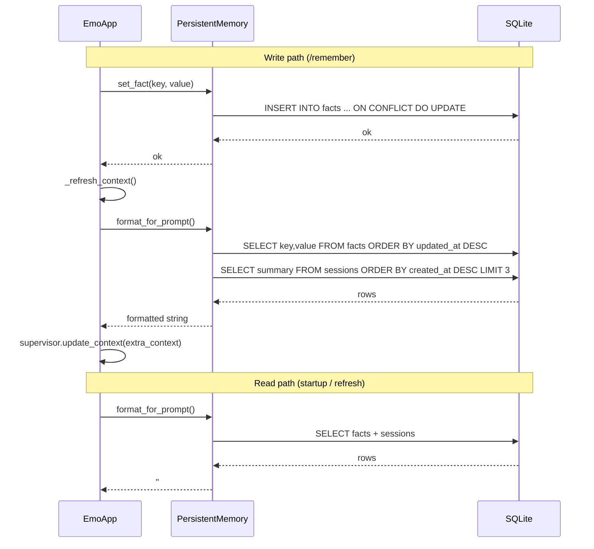
```mermaid
sequenceDiagram
    participant CLI as EmoApp
    participant PM as PersistentMemory
    participant DB as SQLite

    Note over CLI,DB: Write path (/remember)
    CLI->>PM: set_fact(key, value)
    PM->>DB: INSERT INTO facts ... ON CONFLICT DO UPDATE
    DB-->>PM: ok
    PM-->>CLI: ok
    CLI->>CLI: _refresh_context()
    CLI->>PM: format_for_prompt()
    PM->>DB: SELECT key,value FROM facts ORDER BY updated_at DESC
    PM->>DB: SELECT summary FROM sessions ORDER BY created_at DESC LIMIT 3
    DB-->>PM: rows
    PM-->>CLI: formatted string
    CLI->>CLI: supervisor.update_context(extra_context)

    Note over CLI,DB: Read path (startup / refresh)
    CLI->>PM: format_for_prompt()
    PM->>DB: SELECT facts + sessions
    DB-->>PM: rows
    PM-->>CLI: "## Known facts\n...\n## Recent session summaries\n..."
```

---

### 4.7 Session Memory Sliding Window

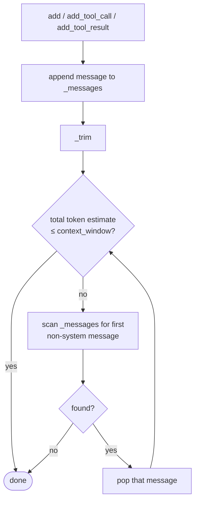
```mermaid
flowchart TD
    A[add / add_tool_call / add_tool_result] --> B[append message to _messages]
    B --> C[_trim]
    C --> D{total token estimate\n≤ context_window?}
    D -- yes --> END([done])
    D -- no --> E[scan _messages for first\nnon-system message]
    E --> F{found?}
    F -- no --> END
    F -- yes --> G[pop that message]
    G --> D
```

Token estimate: `sum(len(json.dumps(m)) // 4 for m in _messages)`

---

### 4.8 Streaming Response

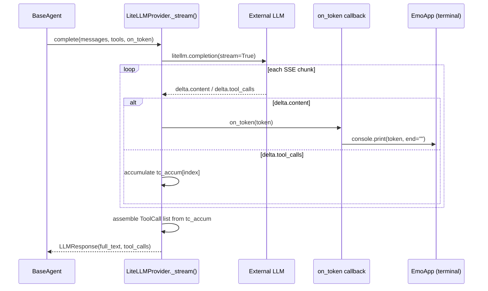
```mermaid
sequenceDiagram
    participant AGT as BaseAgent
    participant PROV as LiteLLMProvider._stream()
    participant LLM as External LLM
    participant CB as on_token callback
    participant REPL as EmoApp (terminal)

    AGT->>PROV: complete(messages, tools, on_token)
    PROV->>LLM: litellm.completion(stream=True)
    loop each SSE chunk
        LLM-->>PROV: delta.content / delta.tool_calls
        alt delta.content
            PROV->>CB: on_token(token)
            CB->>REPL: console.print(token, end="")
        else delta.tool_calls
            PROV->>PROV: accumulate tc_accum[index]
        end
    end
    PROV->>PROV: assemble ToolCall list from tc_accum
    PROV-->>AGT: LLMResponse(full_text, tool_calls)
```

---

### 4.9 Auto-Summarisation

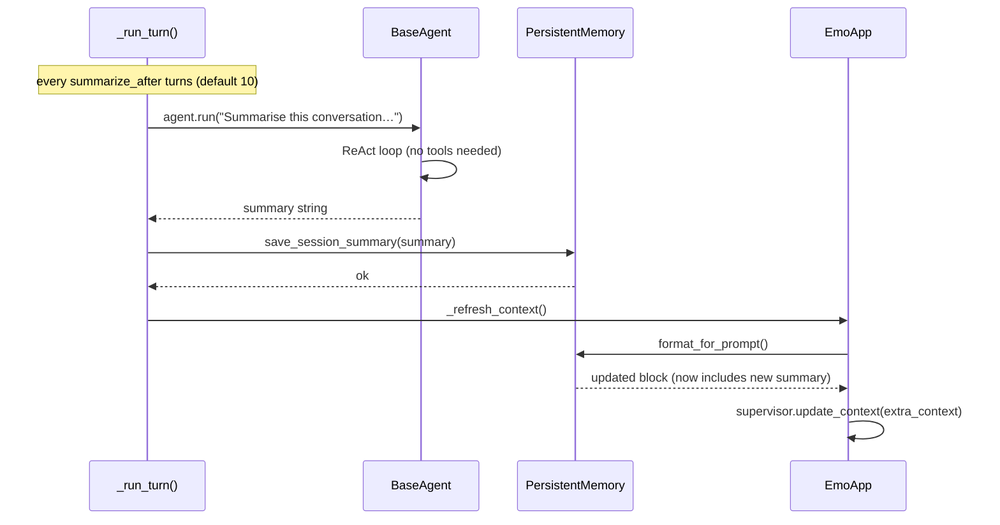
```mermaid
sequenceDiagram
    participant TURN as _run_turn()
    participant AGT as BaseAgent
    participant PM as PersistentMemory
    participant CLI as EmoApp

    note over TURN: every summarize_after turns (default 10)
    TURN->>AGT: agent.run("Summarise this conversation…")
    AGT->>AGT: ReAct loop (no tools needed)
    AGT-->>TURN: summary string
    TURN->>PM: save_session_summary(summary)
    PM-->>TURN: ok
    TURN->>CLI: _refresh_context()
    CLI->>PM: format_for_prompt()
    PM-->>CLI: updated block (now includes new summary)
    CLI->>CLI: supervisor.update_context(extra_context)
```

---

## 5. Extension Points

Every layer exposes an ABC. Swap any layer by subclassing the ABC and injecting the new instance.

### New Tool

```python
from emo.tools import BaseTool, registry

class MyTool(BaseTool):
    name = "my_tool"
    description = "Does something."
    parameters = {
        "type": "object",
        "properties": {"input": {"type": "string"}},
        "required": ["input"],
    }

    def run(self, input: str) -> str:
        return input.upper()

registry.register(MyTool())
```

Or with the decorator:

```python
from emo.tools import tool

@tool(description="Add two numbers.")
def add(a: int, b: int) -> str:
    return str(a + b)
```

### New Agent

```python
from emo.agent import BaseAgent

class AnalystAgent(BaseAgent):
    name = "analyst"
    system_prompt = "You are a data analyst."
    tool_names = ["shell", "file_read"]

supervisor.register("analyst", AnalystAgent)
```

### New Provider

```python
from emo.providers import BaseLLMProvider, LLMResponse

class MyProvider(BaseLLMProvider):
    def complete(self, messages, tools=None, stream_callback=None) -> LLMResponse: ...
    def complete_simple(self, messages) -> str: ...

provider = MyProvider(...)
```

### New Memory Backend

```python
from emo.memory import BaseMemory

class RedisMemory(BaseMemory):
    def add(self, role, content): ...
    def add_tool_call(self, message): ...
    def add_tool_result(self, id, name, content): ...
    def get(self): ...
    def clear(self): ...
```

### Override Routing Logic

```python
from emo.agent.supervisor import Supervisor

class KeywordRouter(Supervisor):
    def _classify(self, user_input: str) -> str:
        if "code" in user_input.lower():
            return "code"
        if "search" in user_input.lower():
            return "research"
        return "general"
```

---

## 6. Dependency Graph

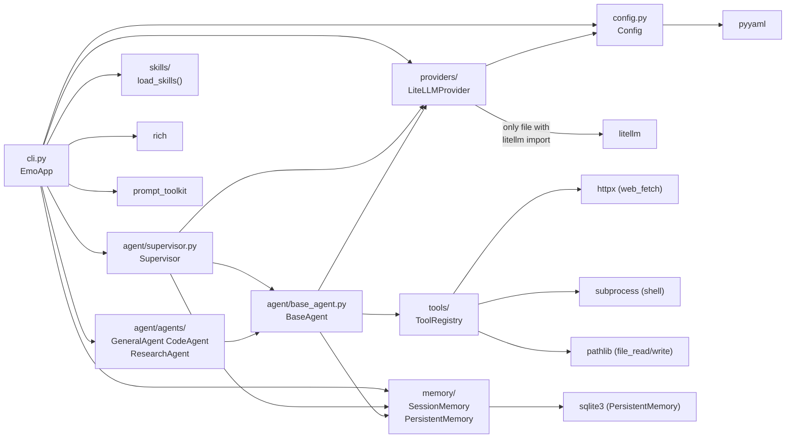
```mermaid
graph LR
    CLI["cli.py\nEmoApp"] --> CFG["config.py\nConfig"]
    CLI --> MEM["memory/\nSessionMemory\nPersistentMemory"]
    CLI --> PROV["providers/\nLiteLLMProvider"]
    CLI --> SUP["agent/supervisor.py\nSupervisor"]
    CLI --> AGENTS["agent/agents/\nGeneralAgent CodeAgent\nResearchAgent"]
    CLI --> SKILLS["skills/\nload_skills()"]

    SUP --> BASE["agent/base_agent.py\nBaseAgent"]
    SUP --> PROV
    SUP --> MEM

    AGENTS --> BASE

    BASE --> PROV
    BASE --> MEM
    BASE --> TOOLS["tools/\nToolRegistry"]

    PROV --> CFG
    PROV -->|"only file with\nlitellm import"| LITELLM["litellm"]

    TOOLS --> HTTPX["httpx (web_fetch)"]
    TOOLS --> SUBPROCESS["subprocess (shell)"]
    TOOLS --> PATHLIB["pathlib (file_read/write)"]

    MEM --> SQLITE["sqlite3 (PersistentMemory)"]
    CFG --> YAML["pyyaml"]
    CLI --> RICH["rich"]
    CLI --> PROMPTTK["prompt_toolkit"]
```
